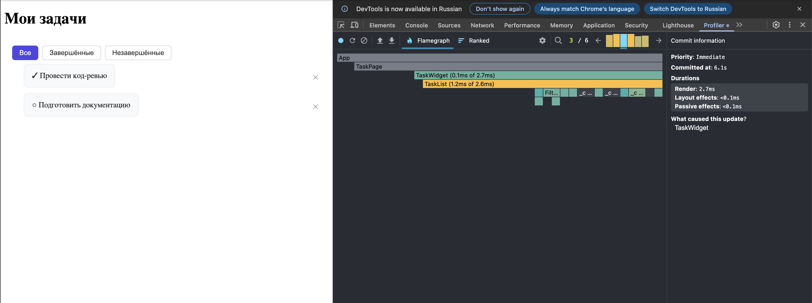

# React + TypeScript + Vite

This template provides a minimal setup to get React working in Vite with HMR and some ESLint rules.

Currently, two official plugins are available:

- [@vitejs/plugin-react](https://github.com/vitejs/vite-plugin-react/blob/main/packages/plugin-react) uses [Oxc](https://oxc.rs)
- [@vitejs/plugin-react-swc](https://github.com/vitejs/vite-plugin-react/blob/main/packages/plugin-react-swc) uses [SWC](https://swc.rs/)

## React Compiler

The React Compiler is not enabled on this template because of its impact on dev & build performances. To add it, see [this documentation](https://react.dev/learn/react-compiler/installation).

## Expanding the ESLint configuration

If you are developing a production application, we recommend updating the configuration to enable type-aware lint rules:

```js
export default defineConfig([
  globalIgnores(["dist"]),
  {
    files: ["**/*.{ts,tsx}"],
    extends: [
      // Other configs...

      // Remove tseslint.configs.recommended and replace with this
      tseslint.configs.recommendedTypeChecked,
      // Alternatively, use this for stricter rules
      tseslint.configs.strictTypeChecked,
      // Optionally, add this for stylistic rules
      tseslint.configs.stylisticTypeChecked,

      // Other configs...
    ],
    languageOptions: {
      parserOptions: {
        project: ["./tsconfig.node.json", "./tsconfig.app.json"],
        tsconfigRootDir: import.meta.dirname,
      },
      // other options...
    },
  },
]);
```

You can also install [eslint-plugin-react-x](https://npmx.dev/package/eslint-plugin-react-x) and [eslint-plugin-react-dom](https://npmx.dev/package/eslint-plugin-react-dom) for React-specific lint rules:

```js
// eslint.config.js
import reactX from "eslint-plugin-react-x";
import reactDom from "eslint-plugin-react-dom";

export default defineConfig([
  globalIgnores(["dist"]),
  {
    files: ["**/*.{ts,tsx}"],
    extends: [
      // Other configs...
      // Enable lint rules for React
      reactX.configs["recommended-typescript"],
      // Enable lint rules for React DOM
      reactDom.configs.recommended,
    ],
    languageOptions: {
      parserOptions: {
        project: ["./tsconfig.node.json", "./tsconfig.app.json"],
        tsconfigRootDir: import.meta.dirname,
      },
      // other options...
    },
  },
]);
```

# Профилирование производительности — React DevTools Profiler

## Что делалось

Запущен React DevTools Profiler, произведены интеракции: переключение фильтров (All → Completed → Incomplete → All), удаление пары задач. Запись остановлена.

## Наблюдения

### 1. `TaskCard` — обернут в `React.memo`

**Что улучшили:** Без memo при любом state-изменении ререндерились все карточки. С memo перерисовываются только те, props которых реально изменились.

---

### 2. `filteredTasks` в хуке `useTasks` — мемоизирован через `useMemo`

**Что улучшили:** Фильтрация массива вызывалась при каждом рендере, создавая новый объект массива. `useMemo` пересчитывает фильтр только при изменении `tasks` или `filter`.

---

### 3. `removeTask` в хуке `useTasks` — стабилизирована через `useCallback`

**Что улучшили:** Без useCallback ссылка на функцию менялась при каждом рендере, что вызывало цепную реакцию: обновился хук → обновился `TaskList` → обновились все `TaskCard`. `useCallback` удерживает стабильную ссылку.

## Скриншот Profiler

> **Комментарий:** На скриншоте Flamegraph видно, что `TaskCard` отображается узкими зелёными полосами — `React.memo` пропускает рендер при неизменных props. `useMemo` для `filteredTasks` и `useCallback` для `removeTask` не создают лишних блоков — ссылки стабильны между интеракциями. При удалении задачи перерисовывается только удаляемая карточка и её родитель `<li>`, остальные компоненты не затрагиваются.


